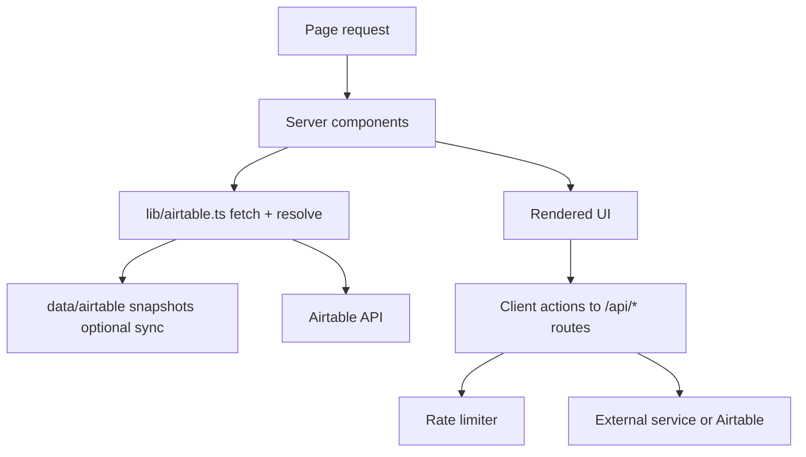
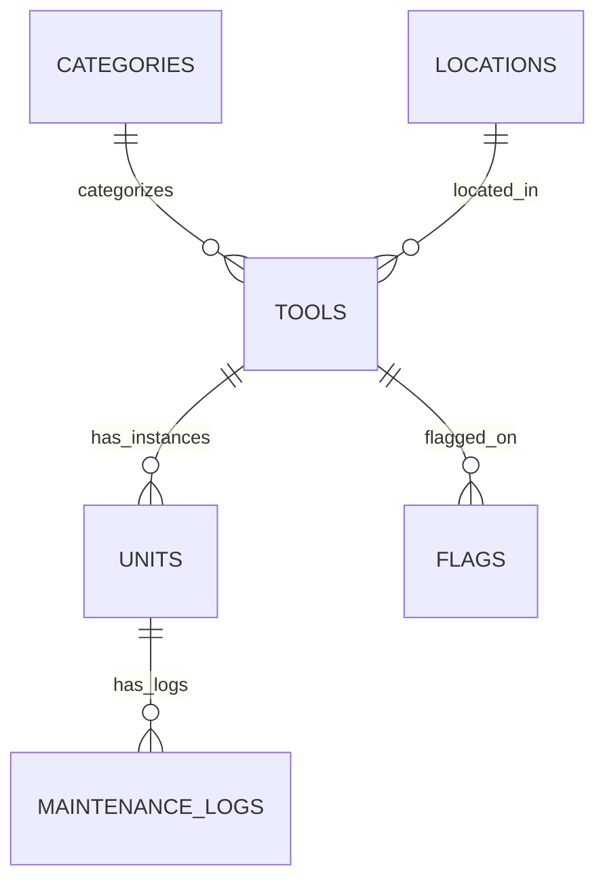

# MakerLab Tools v3

Comprehensive technical documentation for the `v3` stack:
- Next.js web app (`v3/app`)
- MCP server implementations (`v3/app/src/app/api/mcp/route.ts` and `v3/mcp`)
- Airtable-backed data model and sync workflow

## 1. What v3 includes

`v3` provides:
- Tool discovery and filtering for MakerLab inventory
- Tool detail pages with image gallery, docs, safety badges, and unit status
- Unit detail pages with maintenance history and report flow
- AI chat (general planning + tool-specific assistant)
- Image operations (regen, remove background, replacement from approved web hosts)
- MCP endpoint for external AI agents
- Local JSON snapshots of Airtable data for safer sync and review

## 2. Repository layout

```text
v3/
  app/                    # Next.js app (UI + API routes)
    data/airtable/        # Git-versioned Airtable snapshots
    public/tool-images/   # Local tool image artifacts
    scripts/              # Sync and image pipelines
    src/
      app/                # Pages + API routes
      components/         # UI components
      lib/                # Airtable client, rate limit, doc/image utilities
  mcp/                    # Standalone MCP server (stdio/http modes)
  scripts/                # Legacy / utility scripts
```

## 3. Quick start

### Prerequisites
- Node.js 20+
- npm 10+
- Airtable base + API key
- Anthropic API key (chat and image-eval)
- Gemini API key (image generation)

### Install and run

```bash
cd v3/app
npm install
npm run dev
```

Open `http://localhost:3000`.

### Build

```bash
cd v3/app
npm run build
npm run start
```

## 4. Environment variables

Set in `v3/app/.env.local` for local and in Vercel project settings for deploys.

| Variable | Required | Used by | Purpose |
|---|---:|---|---|
| `AIRTABLE_BASE_ID` | Yes | app + scripts + MCP | Airtable base |
| `AIRTABLE_API_KEY` | Yes | app + scripts + MCP | Airtable API auth |
| `ANTHROPIC_API_KEY` | Yes | chat, image evaluation | Claude model access |
| `GEMINI_API_KEY` | Yes (if regen enabled) | `/api/chat`, image generation | Gemini image generation |
| `MCP_API_KEY` | Yes for secured MCP route | `/api/mcp` | Bearer / `x-api-key` auth |
| `USE_LOCAL_TOOL_IMAGES` | Optional | app data resolver | Force local image path usage |
| `NEXT_PUBLIC_USE_LOCAL_TOOL_IMAGES` | Optional | app data resolver | Client-visible mirror of above |
| `UPSTASH_REDIS_REST_URL` | Optional | rate-limit lib | Distributed rate limiting |
| `UPSTASH_REDIS_REST_TOKEN` | Optional | rate-limit lib | Distributed rate limiting token |

## 5. Runtime architecture

### High-level architecture

```mermaid
flowchart LR
  U[User Browser] --> N[Next.js App Router]
  N --> A[Airtable REST + Content APIs]
  N --> C[Anthropic]
  N --> G[Gemini API]
  N --> W[Wikipedia API]
  N --> F[Local image/scripts pipeline]
  X[MCP Client] --> M[/api/mcp]
  M --> A
  M --> C
```

### Request/data flow



## 6. Primary user flows

### A) Browse -> Tool detail -> Unit detail

```mermaid
flowchart LR
  Home[Home /] --> Tool[/tools/:id]
  Tool --> UnitLink[Unit row link]
  UnitLink --> Unit[/units/:id]
  Unit --> Report[/report?unit=:id]
```

### B) QR scan flow

```mermaid
flowchart LR
  Scan[/scan] --> QR[QR scanner]
  QR --> QrRoute[/units/qr/:code]
  QrRoute --> Resolve[Lookup qr_code_id in Airtable]
  Resolve --> Unit[/units/:id]
```

### C) Chat flow (general + tool scoped)

```mermaid
flowchart TD
  ChatUI[Chat component] --> ChatAPI[/api/chat]
  ChatAPI --> Prompt[System prompt builder]
  Prompt --> ToolScope{toolId provided?}
  ToolScope -- yes --> ToolDocs[Fetch tool + linked docs text]
  ToolScope -- no --> Inventory[Fetch full inventory context]
  ChatAPI --> Model[Claude via AI SDK]
  Model --> Tools[Tool calls: get details, report issue, followups, web search, visualize]
  ChatAPI --> Stream[Stream response to UI]
```

### D) Maintenance report flow

```mermaid
flowchart LR
  ReportPage[/report] --> Form[MaintenanceForm]
  Form --> API[/api/maintenance]
  API --> Create[createMaintenanceLog]
  API --> Upload[uploadAttachment sequential]
  Create --> Airtable[(Maintenance_Logs)]
  Upload --> Airtable
```

### E) Image curation flow

```mermaid
flowchart TD
  Actions[ImageActions UI] --> ImgPOST[/api/image POST]
  ImgPOST --> BG[Detached node script task]
  Actions --> Poll[/api/image GET poll]
  Poll --> Done{mtime newer than start?}
  Done -- yes --> Reload[Reload page/gallery]
  Actions --> Search[/api/image-search?q=tool]
  Search --> Wiki[Wikipedia image candidates]
```

## 7. API surface (v3/app)

| Route | Method(s) | Purpose | Auth | Rate limit |
|---|---|---|---|---|
| `/api/chat` | `POST` | AI chat orchestration + tool calling | none | `20/min` per IP |
| `/api/flag` | `POST` | Submit data-quality/content flags | none | `10/min` per IP |
| `/api/maintenance` | `POST` | Create maintenance logs + upload photos | none | `5/min` per IP |
| `/api/image-search` | `GET` | Find candidate replacement images | none | `15/min` per IP |
| `/api/image` | `GET`, `POST` | Poll image updates and start image tasks | none | `5/min` per IP |
| `/api/mcp` | `POST`, `GET`, `DELETE` | MCP streamable HTTP transport | `MCP_API_KEY` required | `30/min` per IP |

### MCP route behavior notes
- Endpoint: `/api/mcp`
- Header auth: `Authorization: Bearer <MCP_API_KEY>` or `x-api-key: <MCP_API_KEY>`
- Expected client `Accept`: include both `application/json` and `text/event-stream`
- In serverless mode, `GET` (SSE style) returns method not allowed message by design

## 8. Data model and table diagrams

Source of types: `v3/app/src/lib/types.ts`

### ER diagram



### Table: `Tools`

| Field | Type | Notes |
|---|---|---|
| `name` | string | Primary display name |
| `description` | string | Tool description |
| `category` | link[] -> Categories | Category link |
| `location` | link[] -> Locations | Location link |
| `materials` | string[] | Supported materials |
| `ppe_required` | string[] | PPE labels |
| `tags` | string[] | Search tags |
| `authorized_only` | boolean | Access restriction |
| `training_required` | boolean | Training gate |
| `use_restrictions` | string | Usage constraints |
| `emergency_stop` | string | Emergency instructions |
| `safety_doc_url` | string | Safety doc URL |
| `sop_url` | string | SOP URL |
| `video_url` | string | Video URL |
| `map_tag` | string | Map label |
| `image_attachments` | attachment[] | Gallery/source images |
| `manual_attachments` | attachment[] | Manual files |

### Table: `Categories`

| Field | Type | Notes |
|---|---|---|
| `name` | string | Subcategory |
| `group` | string | Category group |

### Table: `Locations`

| Field | Type | Notes |
|---|---|---|
| `name` | string | Zone name |
| `room` | string | Room identifier |

### Table: `Units`

| Field | Type | Notes |
|---|---|---|
| `unit_label` | string | Human-readable unit id |
| `tool` | link[] -> Tools | Parent tool |
| `serial_number` | string | Manufacturer serial |
| `asset_tag` | string | Internal tag |
| `status` | enum | Available/In Use/etc |
| `condition` | enum | Excellent/Good/Fair/Needs Repair |
| `date_acquired` | date | Acquisition date |
| `notes` | string | Freeform notes |
| `qr_code_id` | string | QR lookup code |

### Table: `Maintenance_Logs`

| Field | Type | Notes |
|---|---|---|
| `title` | string | Issue title |
| `unit` | link[] -> Units | Target unit |
| `type` | enum | Issue/Repair/Inspection/etc |
| `priority` | enum | Critical/High/Medium/Low |
| `status` | enum | Open/In Progress/Resolved/Closed |
| `reported_by` | string | Reporter |
| `assigned_to` | string | Assignee |
| `description` | string | Details |
| `resolution` | string | Resolution notes |
| `date_reported` | date | Opened date |
| `date_resolved` | date | Closed date |
| `photo_attachments` | attachment[] | Evidence photos |

### Table: `Flags`

| Field | Type | Notes |
|---|---|---|
| `tool` | link[] -> Tools | Flagged tool |
| `field_flagged` | enum | name/description/image/etc |
| `issue_description` | string | What is wrong |
| `suggested_fix` | string | Optional fix |
| `reporter` | string | Reporter id/name |
| `status` | enum | New/Reviewed/Fixed/Dismissed |
| `created_at` | datetime | Created timestamp |

## 9. Airtable sync model

`v3/app/data/airtable` stores JSON snapshots:
- `tools.json`
- `categories.json`
- `locations.json`
- `units.json`
- `sync-state.json`

Sync commands (from `v3/app`):

```bash
npm run sync:pull       # Airtable -> local JSON
npm run sync:images     # Airtable images -> public/tool-images
npm run sync:push       # local JSON -> Airtable
npm run sync:status     # diff/status view
```

## 10. Security and abuse controls

- Input validation: `zod` schemas on mutable endpoints
- IP rate limits: per-route keys in `src/lib/rate-limit.ts`
- Optional distributed limiting via Upstash Redis
- MCP key auth (`MCP_API_KEY`)
- Image source allowlist + DNS/private-IP checks in `/api/image`
- File constraints for maintenance photos (type/count/size)

## 11. Notes for deploys

- App is deployed on Vercel under `makerlab-tools-v3`
- Ensure all required env vars are set for Production
- If MCP auth appears open, verify:
  - latest code deployed
  - `MCP_API_KEY` present in Vercel env
  - client sends required `Accept` header for MCP transport

## 12. Standalone MCP server (`v3/mcp`)

`v3/mcp` is a separate Node/TypeScript MCP server supporting:
- `stdio` transport (default)
- HTTP transport with Express + Streamable MCP

Run:

```bash
cd v3/mcp
npm install
npm run build
npm run start          # stdio
npm run start:http     # HTTP mode
```

This server shares the same MakerLab Airtable concepts and toolset as the web MCP endpoint, but is independently deployable.
